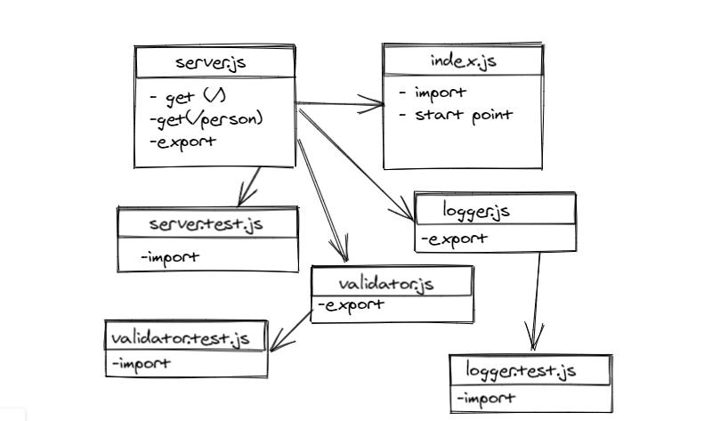

# basic-express-server

## LAB -Express

### Deployment Test

- [ci/cd GitHub Actions](https://github.com/MohammadAljadayh/basic-express-server/actions).
- [herokuapp Link Main ](https://mohammed-basic-express-server.herokuapp.com/).
- [pull request](https://github.com/MohammadAljadayh/basic-express-server/pull/1).
- [Main Repo link](https://github.com/MohammadAljadayh/basic-express-server/tree/main) 

## Setup 

`.env` **requirements**

- `PORT` - 3000

## Running the app 

- `npm start`

- Endpoint person test : `/person?name=mohammad`


## Tests

- `npm run test`


---------------------------------------------------------
UML : 



## Notes

### Express Routing

- Event driven system
  - `app.get('/thing', (req,res) => {})`
  - This is the same pattern we see in Vanilla JS, jQuery
  - 'When a get event happens in our server, on "/thing", run this function...'
- The Request Object
  - `(req,..)`
  - /:parameters
    - `app.get('/api/:thing',...)` = `req.params.thing`
  - Query Strings
    - `http://server/route?ball=round` = `req.query.ball`
- The Response Object
  - `(..., res)`
  - Responsible for sending data back to the browser
  - Has methods like `send()` and `status()` that Express uses to format the output to the browser properly
    - Sends Headers
      - Cookies
      - Status Codes

### Express Middleware

- What does it do?
  - A series of functions that the request "goes through"
  - Each function receives `request`, `response` and `next` as parameters
  - Application Middleware run on every route/request
    - Error Handling, Logging, BODY Parsing
  - Route Middleware runs on specific routes
    - Are you logged in?

Middleware runs your code, and then runs the `next()` middleware in the series.

```javascript
function myLogger(req,res,next) {
  console.log(req.method);
  next(); // runs the next middleware in line
}
```

If you call `next()` with an argument, it'll skip all remaining middleware and run your error handler, with that argument as the error

```javascript
function loggedIn(req,res,next) {
  if( validUser ) { next(); } // Run the next middleware
  else { next("you need to login"); } // Run the error handler, skipping all other middleware
}
```

> Your route handler (your normal `(req,res)` function) is always the last middleware in the series!

### Server Testing

- Generally, avoid starting the actual server for testing
- Instead, export your server as a module in a library
- Then, you can a "mocking library" such as `supertest` to run your tests
  - This will hit your routes as though your server was running, without actually starting it

server.js

```javascript
const express = require('express');
const app = express();
app.get('/data', (req,res) => res.json({}));
// Export an object with the "app" in it.
module.exports = {
  start: () => app.listen(3000),
  server: app
}
```

server.test.js

```javascript
const supertest = require('supertest');
const myServer = require('server.js');
const client = supertest(myServer.server);
describe('my server', () => {
  test('can send data', () => {
    return client.get('/data')
      .then( response => {
        expect(response.body).toBeDefined();
      })
  })
})
```

### Setup for Testing

1. Install "Jest" so that you can run your tests
   `npm install jest`
1. Add the proper "testing scripts" to your `package.json` file

   ```json
   "scripts": {
     "test": "jest --coverage",
     "watch": "jest --coverage --watchAll"
   }
   ```

1. Run your tests on demand
   - `npm test`
1. Run your tests automatically as you save your files1
   - `npm run watch`
